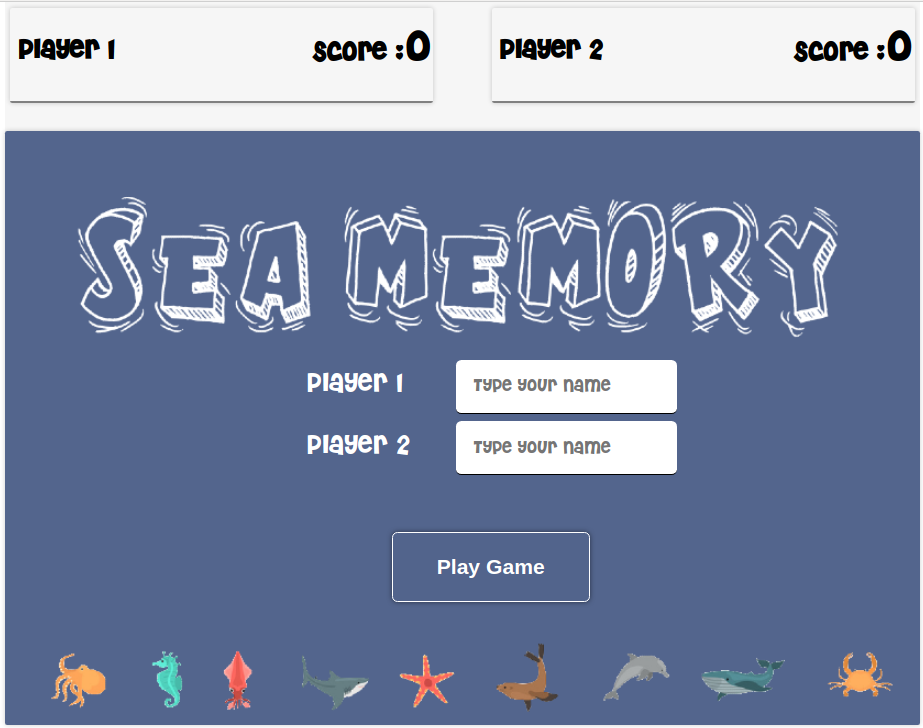
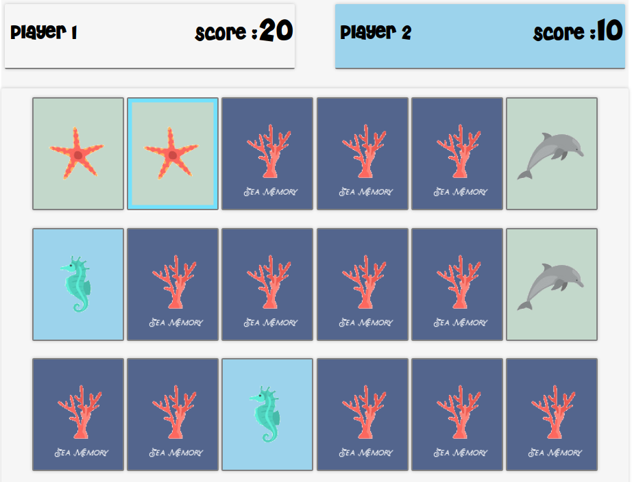
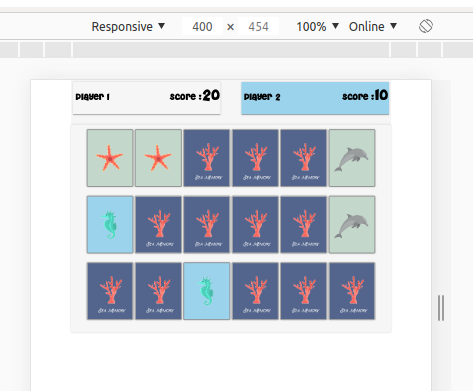

# Sea Memory

A "project pet" game based on a memorama, you have to find matching cards that are hidden and with a random position.

## Demo

Link to the demo: https://albmg.github.io/sea-memory/

## Game Screenshots

## How To Play

- Select cards with mouse click and turn them until you find all the pairs. On your phone/tablet use your fingers.
- Each pair of turned cards adds 10 points to your scoreboard.
- The player who flips the most cards wins.

## Features

- Turn-based game for two players.
- Shift change when two cards do not match.

### To do

- Add sound effects.
- Add animation when fliping cards.
- Add a "Did you know" section.

## Tools
- Visual Studio. 
- Pixlr.
